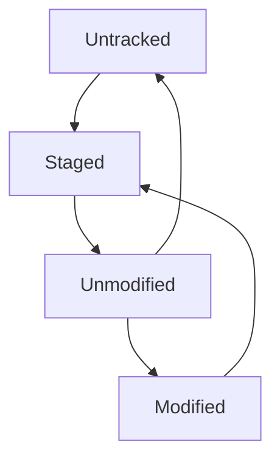

# Git Basics
## 01 Getting a Git repositoty
* **method 01 Initializing a Repo in an Existing Diractory**  
```
    $ cd C:/Users/user/my_projects
    $ git init
    # this create a new foder named ".git"
```

```
    $ git add *.c
    $ git add LICENSE
    $ git commit -m 'Initial project version'
    # this can start a version-controlling some existing files
```

* **method 02 Cloning an Repo**    


