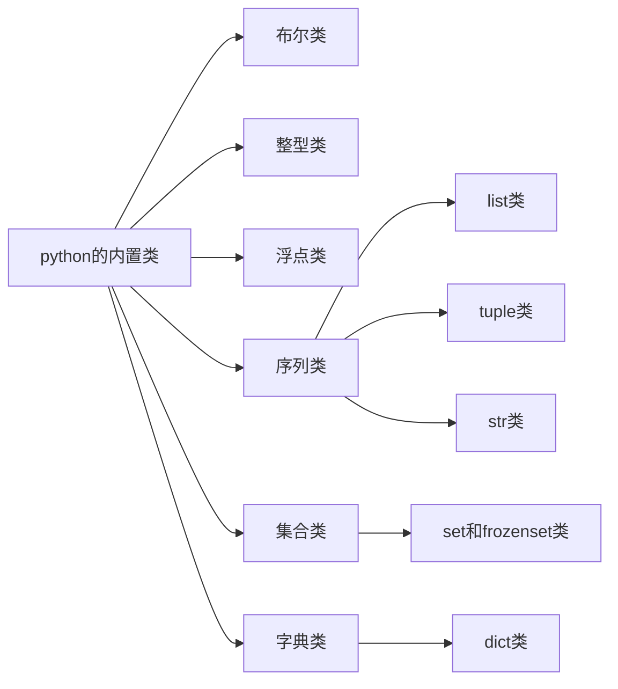

# PYTHON 入门
[toc]
## PYTHON的内置类

### BOOL类
* 用于处理逻辑值，该类表示的实例只有两个值：true和false。
* 默认构造函数```bool()```返回false
```python
    bool()
    #默认构造函数，返回false
    bool(foo)
    #为值foo创造一个布尔类型。
    #对于数字而言，非0则为true；
    #对于序列和其他容器类型，如字符串和列表，空则为false，非空则为true
```
### INT类
* 不像c语言中int类需要根据精度的不同被设计成不同的整数类型(如int，long，short)，python会根据整数的大小自动选择内部表达的形式。
* 二进制、八进制、十六进制的表达更为方便，如```0b1011```,```0o52```,```0x7F```
```python
    int();
    #默认构造函数，返回0
    int(f);
    #当f为一个浮点型时，该构造函数会返回f的整数部分，例子如下
    int(3.14);#返回3
    int(3.99);#返回3
    int(-3.9);#返回-3
    #当f为一个字符串，那么构造函数会得到这个字符串所代表的整数值
    int("134");#返回134
    int("hello");#返回ValueError
    #默认情况下，字符串必须采用十进制，若采用其他进制应当特别表示
    int('7f',16);#返回127,16表示为十六进制
```
### FLOAT类
* float是python中唯一的浮点类别，使用固定精度
* 常见的浮点类型表示
```python
    2. ;#表示2.0，其中0可以忽略不写
    6.022e23;#科学计数法，代表数学上的6.022*10^(23)
```
* 构造函数的使用
```python
    float();
    #默认构造函数，返回值为0.0
    #当给定一个参数时，该构造函数会尝试返回等价的浮点值
    float(2);#返回浮点值2.0
    float('3.14');#返回浮点值3.14
    float('hello');#返回ValueError
```
### LIST类
* list类是可以表示任意对象的序列；tuple类是list类一个**不可改变**的版本，可以看作是list类的一种简化的内部表示；str类表示文本字符不可改变的序列。
* list类是基于数组的序列，采用**零索引**，因此一个长度为n的list序列索引号为从0到n-1的元素。
* **中括号**的使用。
```python
    [];#中括号可以作为list的分割符，同时其本身也表示一个空list类
    ['red','green','yellow'];#一个含有三个字符串实例的列表
```
* 构造函数的使用。
```python
    list();#产生一个空列表
    #构造函数接受任何可以接受迭代的参数
    list('hello');#产生一个单个字符的列表,如下
    ['h','e','l','l','o']
    back = list(data)
    #用于创建一个新的列表对象，该列表对象引用data相同的内容作为back的列表元素
```
### TUPLE类
* tuple类是序列的一个不可改变的版本，有一个比列表更为精简的内部表示。
* **小括号**的使用。
```python
    ();#与list类相反，tuple类中使用小括号作为分割符，同样的其本身也代表一个空的元组
    (17);#表示带括号的数值表达式
    (17,)；#表示一元元组
```
### STR类
* python中的str类专门用来有效的表示一种不变的字符序列。
* 字符串可以用单引号表示，或用双引号括起来。
```python
    "hello";#表示一个字符串
    "Don't worry";#其中单引号作为字符被引用
```
* 配合反斜杠“\”，可以采用转义字符用于表达，常见的转义字符有：\n表示换行，\t表示制表符。
* python也支持在字符串的首尾采用分割符```'''```或```"""```。这种三重引号字符的优点是换行符可以在字符串中自然的出现，而不是使用转义字符```(\n)```，如下。
```python
    print("""Welcome to the GPA calculator.
    Please enter all your letter grades, one per line.
    Enter a blank line to designate the end.""")
    #使用三重引号字符
```
### SET和FROZENSET类
* python中的set类表示一个集合的数学概念，即许多元素的集合。
* 集合中没有重复元素，并且这些元素之间没有内在联系。
* 与列表恰恰相反，使用集合的优点是它有一个高度优化的方法来检查特定元素是否包含在集合内部，这将在之后被提到
* 值得注意的是，在使用该类型时，应当注意两点。一，集合不保存任何有特定顺序的元素集；二，只有不可改变类型的实例才可以成为集合中的元素，因此，只有浮点类，整型类，字符串类的对象才能够组合成为集合，有可能出现元组的集合，但不可能出现由列表组成的集合，或者由集合组成的集合，因为列表和集合是可变的，而frozenset是集合类型的一种不可变的形式，因此由frozenset组合成的集合是合法的。
* 花括号的使用
```python
    {17}
    {'a','b','c'};#这两个都表示集合
    {};#特殊的是，空的花括号并不表示一个空的集合，而表示空的字典
```
* 构造函数的使用
```python
    set();#默认构造函数会产生一个空的集合
    set('hello');#如果给集合的构造函数一个可迭代的参数，那么就会产生不同元素组成的集合
    {'h','e','l','l','o'}
```
### DICT类
* dict类表示一个字典或者映射，即从一组不同的键中找到对应的值。例如，字典可以把学生唯一的学号信息和大量的学生记录进行一一映射。
* 花括号的使用
```python
    {};#产生一个空的字典
    {'ga':'Irish','de','German'};#表示从'ga'到'Irish'，'de'到'German'的一一映射。
```
* dict类的构造函数接受一个现有的映射作为参数，在这种情况下，它创造了一个与原有字典具有相同联系的新字典。

## 表达式、运算符和优先级
* 在使用运算符的情况下，现有的值可以组合成较大的语法表达式，运算符的语义取决于其操作的类型。
### 逻辑运算符
```python
    not;    #逻辑非
    and;    #逻辑与
    or;     #逻辑或
```
### 相等运算符
```python
    is;     #同一实体
    is not; #不同的实体
    ==;     #等价
    !=;     #不等价
```
* 当标识符a和b是同一个对象的别名时，表达式```a is b```的结果为真。```a == b```测试一个更一般的等价概念。
* 如果a和b指向同一个对象，那么表达式```a == b```为真。
* 如果a和b指向不同对象，如果这些对象的值被认为是等价的那么```a == b```也为真，精确的等价结果取决于数据类型。
```python
    #对于两个字符串，如果每个字符对应相同，那么它们可以看作是等价的。
    #对于两个集合，不考虑其顺序，那么这两个集合可以看作是等价的。
```
* 一般情况下使用==和!=就足够了
### 比较运算符
```python
    <;  #小于
    <=; #小于等于
    >;  #大于
    >=; #大于等于
```
* 当操作的数值类型不同时，可能会产生异常。
### 算术运算符
```python
    +;  #加
    -;  #减
    *;  #乘
    /;  #真正的除
    //; #整数除法
    %;  #模数运算
```
* 关于加减乘较为简单，需要注意的是，如果两个操作数均为整型，那么结果也为整型；如果有一个为浮点型，那么结果也为浮点型。
* 除法运算
```python
    27/4;#得到浮点型6.75
    27//4;#得到整型6
    27%4;#得到结果整型3
```
* 负数参与的除法运算
```python
    #假定n和m分别代表商式中的被除数和除数，即n/m,n%m,n//m;r为式子的余，q为式子的商
    #在python中始终保证q*m+r=n
    #当被除数n为负数，除数m为正数时，python进一步保证0 <= r <  m
    -27//4; #得到4*(-7)+1=-27，结果为1
    -27%4;  #结果为-7
    #当被除数n为正数，除数m为负数时，python进一步保证m <  r <= 0
    27//-4; #得到-4*(-7)-1=27，结果为-1
    27%-4;  #结果为-7 
```
* **无论是正是负，余数符号和除数保持一致，且其绝对值小于除数。**
* 浮点型参与的除法运算
```python
    #同样的，始终保证q*m+r=n成立
    8.2//3.14;  #得到3.14*2.0+1.92=8.2，结果为2.0
    8.2%3.14;   #得到1.92
```
### 位运算符 <font color=red>疑问？</font>
```python
    ~;  #取反（前缀一元运算符）
    &;  #按位与
    |;  #按位或
    ^;  #按位异或
    <<; #左位移，用零填充
    >>; #右位移，按符号位填充
```
### 序列运算符
* 该系列运算符位python每一个内置类型的序列（list，tuple和str）都支持以下操作符语法。
```python
    s[j];               #索引下标为j的元素
    s[start:stop];      #切片操作得到索引为[start,stop)的序列
    s[start:stop:step]; #切片操作，新的序列包含索引为
                        #start，start+step，start+2*step+...直到序列结束
    s+t;                #序列的连接
    k*s;                #序列的连接即s+s+...（k次）
    val in s;           #检查元素val在序列s中,返回bool值
    val not in s;       #检查元素val不在序列s中。返回bool值
```
* python中的序列采用**0索引**。
* 同样python也支持**负索引**，表示离序列尾部的距离，索引-1表示序列的最后一个元素，索引-2表示序列的倒数第二个元素。
* python采用**切片标记法**来描述一个序列的子序列。切片被描述为一种**半开放状态**，即开始索引的元素包含在内，结束索引的元素排除在外。如果切片中省略了一个起始索引或结束索引，则假设起始或者结束对应的是原始序列的头或尾。
* ```s[j] = val```可以用于**替换**给定索引的元素。
* ```del s[j]```可以从列表中**删除**指定元素。
* 所有序列的比较操作都是基于**字典顺序**，即一个元素一个元素地比较，直至找到第一个不同的元素，例如```[5,6,9] < [5,7]```。由序列类型支持的操作如下。
```python
    s == t; #相等（每一个元素对应相等）
    s != t; #不相等
    s < t;  #字典序地小于
    s <= t; #字典序地小于等于
    s > t;  #字典序地大于
    s >= t; #字典序地大于等于
```
### 集合的运算符
```python
    key in s;       #检查key是s的成员
    key not in s;   #检查key不是s的成员
    s1 == s2;       #s1等价s2
    s1 != s2;       #s1不等价s2
    s1 <= s2;       #s1是s2的子集
    s2 < s2;        #s1是s2的真子集
    s1 >= s2;       #s1是s2的超集
    s1 > s2;        #s1是s2的真超集
    s1 | s2;        #s1与s2的并集
    s1 & s2;        #s1与s2的交集
    s1 - s2;        #s1与s2的差集
    s1 ^ s2;        #对称差分（该集合中的元素在s1与s2的其中之一）
```
### 字典的运算符
```python
    d[key];         #给定键key所关联的值
    d[key] == value;#设置（或重置）与给定的键值向关联的值
    del d[key];     #从字典中删除键及其相关联的值
    key in d;       #检查key是d的成员
    key not in d;   #检查key不是d的成员
    d1 == d2;       #d1等价d2
    d1 != d2;       #d1不等价d2
```
* 字典像集合一样，它们的元素并没有一个明确定义的顺序。此外对于字典子集的概念并没有太大意义，所以字典没有比较相关的运算方式，但是字典有等价的概念。如果两个字典包含相同的键-值对应，那么```d1 == d2```。
* 字典的索引，键值k对应的数值表示为```d[k]```。
### 拓展赋值运算符
* ```+=```符号是一种扩展赋值运算符。```count += 5```与```count = count + 5```意思相同。
```python
    alpha = [1,2,3]
    beta = alpha
    beta += [4,5]
    beta = beta + [6,7]
    print(alpha);   #print out []
    print(beta);    #
```
### 符合表达式和运算符的优先级