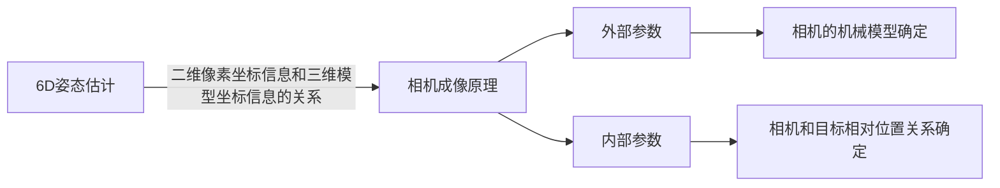

# 大纲
## 课题介绍
* 本课题针对物理模型试验中浮体结构测试的关键技术问题，提出一种基于机器学习算法的位姿参数智能辨识系统设计方案，开发一种基于位姿估计的物体6D运动参数非接触式测量方法。主要采用多目摄像头进行图像采集，利用深度神经网络进行图像关键点提取，利用PNP位姿解算方法得到位姿参数辨识结果，利用位姿估计结果计算物体指定关键点的位移、速度、姿态角、频率等运动参数。

## 课题分解

### 如何进行图像关键点采集？
### 如何进行位姿解算？
* 什么是6D姿态估计？6D姿态估计是根据二维图像获取在拍摄时三维目标相对于相机的位置和姿态，也就是获得相机6个自由度上的位移信息，该关系是由相机的成像原理所决定的。

* 位姿解算思路
  * 思路1：基于整体预测的方法
  * 思路2：基于对应关系的两阶段方法
    * PNP位姿解算方法。Perspective-n-Point method。即求解3D到2D点的对应方法，描述了当知道n个3D空间点及其位置，如何估算相机的位姿。PNP问题源自相机的位姿估计，并被开发求解6D姿态问题。
### 位姿计算结果如何得到关键点的运动参数？