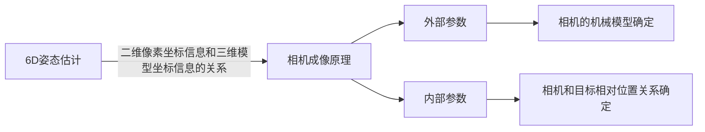

# 位姿解算
## 什么是6D姿态估计？6D姿态估计是根据二维图像获取在拍摄时三维目标相对于相机的位置和姿态，也就是获得相机6个自由度上的位移信息，该关系是由相机的成像原理所决定的。

## 位姿解算思路
### 思路1：基于整体预测的方法
* 该方法直接构件网络模型估计目标的姿态。
* 早期的基于整体预测的6D姿态估计方法主要通过模板匹配的方式实现，而近期的是采用深度学习算法实现。
* 方法：PoseCNN，ConvPoseCNN，SilhoNet
### 思路2：基于对应关系的两阶段方法
* 该方法首先建立3D-3D或2D-3D对应关系，然后最小二乘法或将随机采样一致性算法（RANSAC）与透视n点（pnp）算法相结合来求解目标姿态。
* PNP位姿解算方法。Perspective-n-Point method。即求解3D到2D点的对应方法，描述了当知道n个3D空间点及其位置，如何估算相机的位姿。PNP问题源自相机的位姿估计，并被开发求解6D姿态问题。