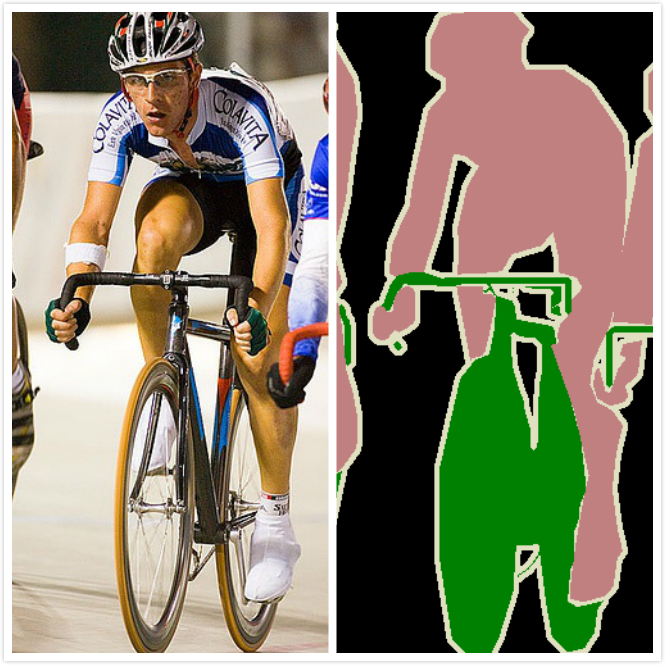

## 两阶段目标检测算法
* “两阶段”先提取物体区域，再对区域进行CNN分类识别，因此两阶段又被称为基于候选区域(Region propsal)的目标检测
  
## 语义分割任务
* 从字面上理解，就是让计算机根据图像的语义来进行分割，如下图所示，左图所表示的语义就是三个人在骑自行车，那么右图要进行的语义分割就是三个人和三辆自行车，并分别对这几个对象进行标注。

## 深度信息
* 相机在获取图像，相当于将三维的图像投影到二维平面中去，这种投影舍弃了一个维度的信息，而从二维到三维的逆映射又是不可行的。而深度信息，具体可以理解为图像上各点到相机的距离，进一步抽象这一概念，就是图像上各点到脱离这一平面维度的距离。
## PNP位姿解算方法
* Perspective-n-Point method。即求解3D到2D点的对应方法，描述了当知道n个3D空间点及其位置，如何估算相机的位姿。
## CNN卷积神经网络

## IMU
* 惯性测量单元（inertial measurement unit）的缩写
## 齐次坐标
* 齐次坐标是用N+1个数来表示N维坐标的一种方式
*  (1, 2, 3), (2, 4, 6)和(4, 8, 12)这三个点对应于同一个欧氏点(1/3, 2/3). 而任何乘以a的数（1a，2a，3a）与欧氏空间中的（1/3，2/3）是同一个点。因此，这些点是 “homogeneous/齐次”的，因为它们在欧氏空间（或笛卡尔空间）中代表同一个点。换句话说，齐次坐标是与乘数a不相关的。