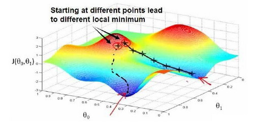

## 什么是机器学习
* Tom Mitchell(1998) Well-posed Learning Problem: A computer program is said to learn from experience E with respect to some task T and some performance measure P, if its performance on T,as measured by P, improves with experience E.

### 监督学习
 * In supervised learning，the right answers have been given.
 * 其基本思想是我们的数据集中的每一个样本都有正确的答案，再根据这些样本做出预测。
 * 监督学习中有回归问题，和分类问题。其中回归问题的数据集在实数域中分布，得到的是一个连续的值；而分类问题的数据集都可以抽象为0和1的布尔类型。

### 非监督学习
* In unsupervised learning, the right answers are not given.
* 无监督学习是，假如我们没有提前告知算法一些信息，比如，这是第一类的人，那些是第二类的人，还有第三类，等等。我们只是说，是的，这是有一堆数据。我不知道数据里面有什么。我不知道谁是什么类型。我甚至不知道人们有哪些不同的类型，这些类型又是什么。但你能自动地找到数据中的结构吗？就是说你要自动地聚类那些个体到各个类，我没法提前知道哪些是哪些。因为我们没有给算法正确答案来回应数据集中的数据，所以这就是无监督学习。

### 单变量线性回归 Linear regression
* 通常用小写的$m$来表示训练样本的数目，$x$代表特征输入变量，$y$代表输出变量，$(x,y)$代表训练集中的实例，$(x^{(i)},y^{(i)})$代表第i个观察实例。
* 回归问题指，我们根据之前的数据预测出一个准确的输出值。

*  $h$代表hypothesis(假设)，表示一个函数，输入是房屋尺寸大小，就像你朋友想出售的房屋，因此$h$根据输入的$x$值来得出$y$值，$y$值对应房子的价格 因此，$h$是一个从$x$到$y$的函数映射。
*  Linear regression（线性回归）$h_0 (x) = \theta_0 + \theta_1 x$，对于只有一个变量，称之为单变量线性回归问题。

### 代价函数 cost function 
* 代价函数有助于帮助我们弄清楚，如何可以在所有可能的直线中找到最拟合我们数据的直线。即，找到对应的$\theta_0$和$\theta_1$使得$h_0 (x)$和实际值$y$尽可能接近。
* 建模误差（modeling error）指模型所预测的值和训练集中实际值的误差。
* 写出代价函数如下，用平方和表示误差，也可以写为 square error function
$$ J(\theta_0 + \theta_1) = \frac{1}{2m} \sum_{i=1}^{m} {(h_0(x^i) - y^i)^2} \\
目标是找到 \mathop{minimize} \limits_{\theta_0,\theta_1} J(\theta_0,\theta_1)$$

### 梯度下降 Gradient Descent
* 讲解用梯度最小算法来求解代价函数的最小值。
* 开始先随机选择一个参数组合$(\theta_0,\theta_1,...\theta_n)$，计算代价函数，然后我们寻找下一个能让代价函数值下降最多的参数组合，持续这么做直到找到一个局部最小值（local minimum），由于我们并没有尝试所有组合，所以不能确定是否找到的是全局最小值（global minimum），选择不同的参数组合可以找到不同的局部最小值。

* 想象一下你正站立在山的这一点上，站立在你想象的公园这座红色山上，在梯度下降算法中，我们要做的就是旋转360度，看看我们的周围，并问自己要在某个方向上，用小碎步尽快下山。这些小碎步需要朝什么方向？如果我们站在山坡上的这一点，你看一下周围，你会发现最佳的下山方向，你再看看周围，然后再一次想想，我应该从什么方向迈着小碎步下山？然后你按照自己的判断又迈出一步，重复上面的步骤，从这个新的点，你环顾四周，并决定从什么方向将会最快下山，然后又迈进了一小步，并依此类推，直到你接近局部最低点的位置。
$$ \theta_j := \theta_j - \alpha\frac{\partial}{\partial \theta_0} J(\theta_0, \theta_1) $$
* 其中$\alpha$是学习率（learning rate），它决定了我们沿着能让代价函数下降程度最大的方向向下迈出的步子有多大，在批量梯度下降中，我们每一次都同时让所有的参数减去学习速率乘以代价函数的导数。
* 当待定参数只有一个时，来理解这个问题，如下图
* 当点已经处在最低点时，导数项为0，点位置不再发生变化，故该方法只能找到局部最小点（导数为0点）
* 在梯度下降法中，当我们接近局部最低点时，梯度下降法会自动采取更小的幅度，这是因为当我们接近局部最低点时，很显然在局部最低时导数等于零，所以当我们接近局部最低时，导数值会自动变得越来越小，所以梯度下降将自动采取较小的幅度，这就是梯度下降的做法。所以实际上没有必要再另外减小$\alpha$。
* 如下图所示的一些图片做一些结合说明。

* $\alpha$控制着梯度下降算法的下降速度，但是如图3当学习率过大的时候，可能导致点直接越过最低点，从而发生不收敛现象。
* 图1则解释了梯度下降算法的数学直观含义。如图2，不管斜率是正是负，该算法都可以保证已知点向最低点前进。
* 当点逐渐接近局部最低点时，曲线的斜率会越来越小，向最低点移动的步距也会越来越小。
* 我们刚刚使用的算法，有时也称为批量梯度下降。实际上，在机器学习中，通常不太会给算法起名字，但这个名字”批量梯度下降”，指的是在梯度下降的每一步中，我们都用到了所有的训练样本，在梯度下降中，在计算微分求导项时，我们需要进行求和运算，所以，在每一个单独的梯度下降中，我们最终都要计算这样一个东西，这个项需要对所有个训练样本求和。因此，批量梯度下降法这个名字说明了我们需要考虑所有这一"批"训练样本，而事实上，有时也有其他类型的梯度下降法，不是这种"批量"型的，不考虑整个的训练集，而是每次只关注训练集中的一些小的子集。在后面的课程中，我们也将介绍这些方法。
